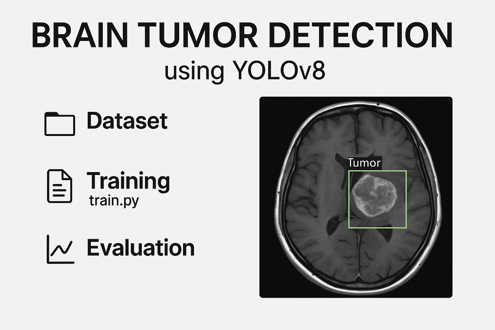

# Brain-Tumor-detection-using-YOLOV8

A deep learning pipeline for detecting brain tumors from MRI scans using the YOLOv8 object detection model.

  

## 🔍 Overview

This project fine-tunes YOLOv8 to detect and classify brain tumors—such as glioma, meningioma, and pituitary tumors—as well as tumor‑free MRI images. The goal is real‑time accuracy in localizing tumors and providing actionable insights for medical use.

  

### Detailed process diagram

  

## 📁 Repository Structure

## 🧠 Dataset

- Uses annotated MRI images from [Kaggle Brain Tumor Detection dataset] or equivalent

- ~2,000 images across glioma, meningioma, pituitary tumor, and no tumor categories

- Config file (brain_tumor_dataset.yaml) defines class labels and splits for YOLOv8 training

## 🚀 Training Process

Trained YOLOv8-nano and YOLOv8-medium models for various epochs (e.g. 25–30)

Experimented with optimizers: Adam, Adamax, RMSProp at learning rates around 0.001 and batch size ~32 

Sample performance:

    - YOLOv8-nano (Adamax): Precision ~84.5%, Recall ~80.6%

    - YOLOv8-medium (Adamax): Precision ~89.9%, Recall ~86.5% 

## 📊 Evaluation & Results

Precision-recall curves and loss plots included in evaluation/

Best models achieve high detection accuracy and recall across tumor classes

Overall mAP up to ~90%, with Yolov8-medium + Adamax showing strongest results

## 🛠️ Usage

Clone repository

Install dependencies:

`pip install -r requirements.txt`

Prepare dataset and annotation file (.yaml)

Run training:

`python train.py --model yolov8m --epochs 30 --batch 32 --lr 0.001 --optimizer adamax`

Inference:

`python inference.py --weights models/best.pt --source path/to/image.jpg`

## 📚 References

- YOLOv8: state‑of‑the‑art object detection system.

- Research on modified YOLOv8 architectures achieving mAP up to ~91% with ViT/RT‑DETR improvements 

- Specialized implementations like BGF‑YOLO showing consistent gains on Br35H dataset
